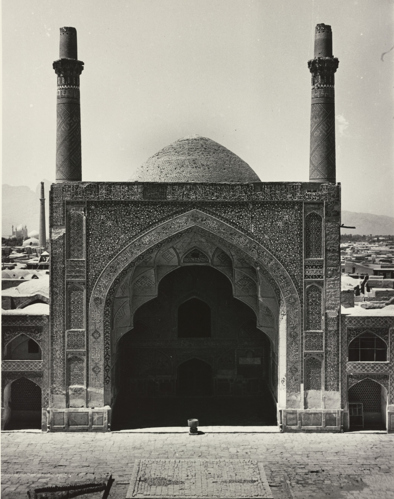
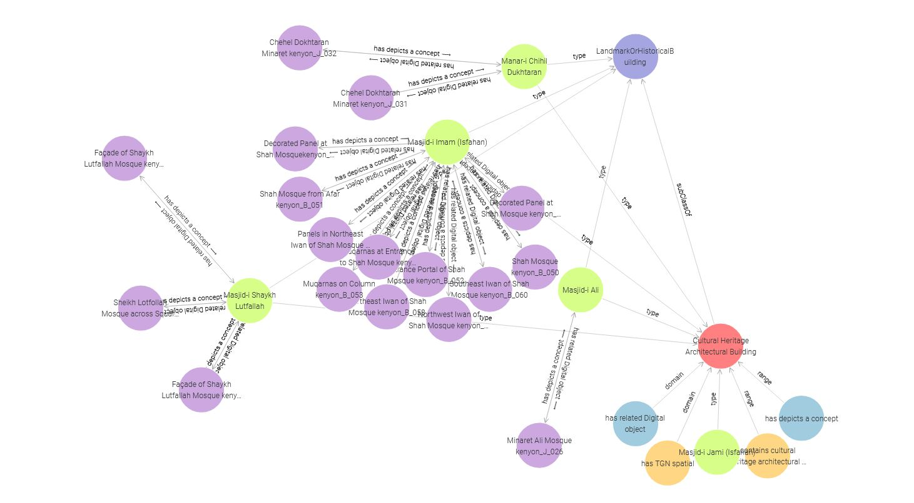

# Persian Architecture

## Overview
The Persian Architecture Ontology is a structured knowledge representation designed to catalog and describe digital resources related to Persian architectural monuments. It leverages Semantic Web technologies, specifically RDF and OWL, to model concepts, relationships, and metadata about architectural entities and their associated resources. The ontology is built using standard vocabularies such as OWL, RDF, RDFS, FOAF, BIBO, and QUDT, and it incorporates the Persian (Farsi) language for cultural specificity.

This project aggregates and organizes digital resources (e.g., images, slides, engravings, architectural plans) related to Persian architectural monuments using Semantic Web technologies. The workflow leverages the Internet Archive for resource hosting, IIIF (International Image Interoperability Framework) for standardized access, and a custom Python script to search, process, and generate RDF data based on the Persian Architecture Ontology (`mdhn:`). The resulting RDF data links digital resources to monuments and their associated metadata, enabling structured queries and analysis.

## Workflow Description
The project follows a streamlined process to aggregate and represent digital resources as RDF data, integrating metadata and taxonomy terms. Below is the step-by-step workflow:

### 1. Resource Hosting on the Internet Archive
- **Description**: Digital resources, represented as instances of `mdhn:VisualArtwork`, are uploaded to the Internet Archive and is available  [Here](https://archive.org/search?query=genre%3A%22Persian+Architecture%22&page=2).


- **IIIF Manifest Creation**: Upon upload, the Internet Archive automatically generates an IIIF manifest for each resource. These manifests are JSON files that describe the resource’s structure, metadata, and access details, ensuring interoperability with IIIF-compliant viewers.
- **Metadata**: Each resource includes simple key-value pair metadata in a `genre` field, which defines the subject or category of the resource (e.g., "Islamic architecture," "Tilework").

### 2. Search and Retrieval
- **Search Mechanism**: A Python script queries the Internet Archive to identify resources within a specific collection based on predefined values in the `genre` field.
- **Output Format**: The search results are returned in a JSON file, listing unique items in the collection. Each item includes A unique identifier which is more than enough to access the `IIIF manifest` of the resource.


### 3. Parsing IIIF Manifests
- **Manifest Processing**: The Python script loads and parses the IIIF manifest for each resource in the search results.
- **Metadata Extraction**: The script extracts metadata, focusing on the `genre` and `subject` fields, which specifies subjects or themes associated with the resource. Specially the subjects are mapped to instances of `mdhn:SubjectTerm` in the ontology.
- **Monument Association**: Each resource is linked to a specific Persian architectural monument (an instance of `mdhn:CHABuilding`) via the `mdhn:hasDepicts` object property, as specified in the manifest or metadata.

### 4. RDF Generation
- **Ontology Integration**: The script generates RDF triples based on the Persian Architecture Ontology (`mdhn:`), which defines classes (e.g., `mdhn:CHABuilding`, `mdhn:VisualArtwork`, `mdhn:SubjectTerm`) and object properties (e.g., `mdhn:hasDepicts`, `mdhn:hasSubject`).
- **Data Representation**:
  - Each resource is represented as an instance of `mdhn:VisualArtwork`.
  - The monument it depicts is represented as an instance of `mdhn:CHABuilding`, linked via `mdhn:hasDepicts`.
  - Subjects from the `subject` field are represented as instances of `mdhn:SubjectTerm`, linked via `mdhn:hasSubject`.
  - The `genre` field is used to uniquly  choose the resources that directly related to this project. 
- **Output**: The RDF data is serialized in a format compatible with the ontology (e.g., Turtle), ready for loading into a triplestore (e.g., Apache Jena, GraphDB).

### 5. Data Utilization
- **Storage**: The generated RDF data is stored in the repository’s `/data` directory or loaded into a triplestore for querying.
- **Querying**: The RDF data can be queried using SPARQL to retrieve information about monuments, their associated digital resources, and taxonomy terms.
- **Applications**: The structured data supports cultural heritage research, geospatial analysis, and educational applications by providing a rich, interconnected knowledge graph.

## Example Workflow
1. **Upload**: An image of the Jameh Mosque is uploaded to the Internet Archive with `genre: Islamic architecture`.
2. **Search**: The Python script searches the Internet Archive for resources in the Persian architecture collection with `genre: Islamic architecture`, returning a JSON file with the image’s IIIF manifest and metadata.
3. **Parse**: The script parses the manifest, extracting the `genre` value ("Islamic architecture") and the monument reference (e.g., `mdhn:JamehMosque`).
4. **Generate RDF**:
   ```turtle
   @prefix mdhn: <http://www.example.org/persian-architecture#> .
   @prefix rdfs: <http://www.w3.org/2000/01/rdf-schema#> .

   mdhn:Resource1 a mdhn:VisualArtwork ;
                  rdfs:label "Image of Jameh Mosque"@en ;
                  mdhn:hasDepicts mdhn:JamehMosque ;
                  mdhn:hasSubject mdhn:IslamicArchitecture .

   mdhn:JamehMosque a mdhn:CHABuilding ;
                    rdfs:label "Jameh Mosque"@en .

   mdhn:IslamicArchitecture a mdhn:SubjectTerm ;
                           rdfs:label "Islamic architecture"@en .
   ```
5. **Store and Query**: The RDF is stored and can be queried to find all resources depicting the Jameh Mosque or tagged with "Islamic architecture."

## Technical Details
- **Python Script**: The script uses libraries like `requests` for API calls to the Internet Archive, `json` for parsing manifests, and `rdflib` for generating RDF triples.
- **IIIF Compliance**: Ensures resources are accessible via IIIF viewers, supporting high-resolution zooming and standardized metadata.
- **Ontology**: The RDF data adheres to the Persian Architecture Ontology, with reconciliation to Archnet IDs, AAT terms, and Wikidata for interoperability.
- **Output**: JSON search results and RDF data are stored in the repository for further processing or analysis.

## Benefits
- **Interoperability**: IIIF-compliant resources and standardized ontology ensure compatibility with global cultural heritage platforms.
- **Scalability**: The automated workflow supports large-scale aggregation of resources.
- **Discoverability**: Linking to Archnet, AAT, and Wikidata enhances resource discoverability.
- **Flexibility**: The RDF data supports complex SPARQL queries for research and analysis.

## Future Enhancements
- The instances of mdhn:CHABuilding can be a very complex monument. Decomposing such monuments to multiple internal spaces which hierarchically belong to the master building.
- Involving `CIDOC-CRM` to manage more sophisticated scenarios.
- Automate reconciliation with AAT and Wikidata during RDF generation.
- Controlled vocabulary with limited scope to specify the Resource Types.
- Expand the script to support additional metadata fields or resource types.
- Integrate with IIIF viewers for interactive resource exploration within the repository.
- Target other GLAMs.

## Repository Integration
This workflow is implemented in the [Persian Architecture Digital Resources Repository](https://github.com/MehranDHN/ArchResources). Relevant files include:
- **`/scripts`**: Python script for searching and RDF generation.(not published yet)
- **`/data/turtles`**: RDF data and ontology.
- **`/imgsrc`**: Images used in readme.md.

This ontology facilitates the organization, retrieval, and analysis of information about Persian architectural monuments, their documentation, and related metadata, making it a valuable tool for researchers, historians, and cultural heritage professionals.



## Ontology Structure
The ontology is defined with the following namespaces:
- `@prefix : <http://www.example.org/persian-architecture#>`: Base namespace for the ontology.
- Standard vocabularies: `owl`, `rdf`, `rdfs`, `foaf`, `bibo`, `qudt`, `xml`, `xsd`, `dc`, `dcterms`, `skos`.

The ontology includes:
- **Classes**: Representing key concepts such as architectural monuments, digital resources, and related entities.
- **Object Properties**: Defining relationships between these entities.
- **Annotations**: Providing metadata such as labels, comments, and versioning information.

## Entities (Classes)
The ontology defines several classes to represent the core concepts of Persian architectural monuments and their digital documentation. Below is a description of each class:

1. **Monument**
   - **Description**: Represents a physical Persian architectural monument, such as a mosque, palace, or historical site.
   - **Annotations**:
     - `rdfs:label`: "Monument"@en
     - `rdfs:comment`: "A physical structure or site of historical or cultural significance in Persian architecture."@en
   - **Purpose**: Used to describe tangible architectural entities, their historical context, and physical attributes.

2. **DigitalResource**
   - **Description**: Represents digital content (e.g., images, documents, videos) related to Persian architectural monuments.
   - **Annotations**:
     - `rdfs:label`: "DigitalResource"@en
     - `rdfs:comment`: "A digital artifact such as an image, document, or video that documents or describes a Persian architectural monument."@en
   - **Purpose**: Captures digital representations or documentation of monuments, enabling linkage to physical entities.

3. **Person**
   - **Description**: Represents individuals (e.g., architects, historians, or contributors) associated with the monuments or their digital resources.
   - **Annotations**:
     - `rdfs:label`: "Person"@en
     - `rdfs:comment`: "An individual associated with a monument or digital resource, such as an architect or document creator."@en
   - **Purpose**: Tracks human contributors, such as those who created or documented the monuments.

4. **Organization**
   - **Description**: Represents entities such as institutions, museums, or research organizations involved with the monuments or resources.
   - **Annotations**:
     - `rdfs:label`: "Organization"@en
     - `rdfs:comment`: "An entity such as a museum or institution involved with Persian architectural monuments or their digital resources."@en
   - **Purpose**: Models institutional stakeholders in the preservation or documentation of Persian architecture.

5. **Location**
   - **Description**: Represents the geographical location of a monument.
   - **Annotations**:
     - `rdfs:label`: "Location"@en
     - `rdfs:comment`: "A geographical place where a Persian architectural monument is located."@en
   - **Purpose**: Provides spatial context for monuments, enabling geospatial queries.

## Object Properties
The ontology defines several object properties to describe relationships between entities. Below is a description of each property:

1. **hasDigitalResource**
   - **Domain**: `Monument`
   - **Range**: `DigitalResource`
   - **Description**: Links a monument to its associated digital resources (e.g., photos, documents).
   - **Annotations**:
     - `rdfs:label`: "hasDigitalResource"@en
     - `rdfs:comment`: "Relates a monument to a digital resource that documents or describes it."@en
   - **Example**: A mosque (Monument) may have a digital photo (DigitalResource) linked via this property.

2. **createdBy**
   - **Domain**: `DigitalResource`
   - **Range**: `Person` or `Organization`
   - **Description**: Indicates the creator of a digital resource, such as the photographer or institution that produced a document.
   - **Annotations**:
     - `rdfs:label`: "createdBy"@en
     - `rdfs:comment`: "The person or organization that created the digital resource."@en
   - **Example**: A historical document (DigitalResource) created by a museum (Organization).

3. **locatedIn**
   - **Domain**: `Monument`
   - **Range**: `Location`
   - **Description**: Specifies the geographical location of a monument.
   - **Annotations**:
     - `rdfs:label`: "locatedIn"@en
     - `rdfs:comment`: "The geographical location where a monument is situated."@en
   - **Example**: A palace (Monument) located in Isfahan (Location).

4. **references**
   - **Domain**: `DigitalResource`
   - **Range**: `Monument`
   - **Description**: Indicates that a digital resource references or describes a specific monument.
   - **Annotations**:
     - `rdfs:label`: "references"@en
     - `rdfs:comment`: "The monument that a digital resource describes or documents."@en
   - **Example**: A research paper (DigitalResource) referencing the Jameh Mosque (Monument).

## SPARQL Query Examples
Below are example SPARQL queries demonstrating the capabilities of the RDF data based on this ontology. These queries assume the ontology is loaded into a triplestore (e.g., Apache Jena or GraphDB) with sample data.

### Query 1: Retrieve All Monuments and Their Locations
**Purpose**: Find all Persian architectural monuments and their associated geographical locations.
```sparql
PREFIX : <http://www.example.org/persian-architecture#>
PREFIX rdfs: <http://www.w3.org/2000/01/rdf-schema#>

SELECT ?monument ?monumentLabel ?location ?locationLabel
WHERE {
  ?monument a :Monument ;
            rdfs:label ?monumentLabel ;
            :locatedIn ?location .
  ?location rdfs:label ?locationLabel .
}
```
**Expected Output**: A list of monuments (e.g., "Jameh Mosque") and their locations (e.g., "Isfahan").

### Query 2: Find Digital Resources for a Specific Monument
**Purpose**: Retrieve all digital resources associated with a specific monument (e.g., Jameh Mosque).
```sparql
PREFIX : <http://www.example.org/persian-architecture#>
PREFIX rdfs: <http://www.w3.org/2000/01/rdf-schema#>

SELECT ?resource ?resourceLabel ?creator ?creatorLabel
WHERE {
  ?monument a :Monument ;
            rdfs:label "Jameh Mosque"@en ;
            :hasDigitalResource ?resource .
  ?resource rdfs:label ?resourceLabel ;
            :createdBy ?creator .
  ?creator rdfs:label ?creatorLabel .
}
```
**Expected Output**: A list of digital resources (e.g., "Photo of Jameh Mosque") and their creators (e.g., "Isfahan Museum").

### Query 3: Identify Creators of Digital Resources
**Purpose**: Find all persons or organizations that created digital resources and the monuments they reference.
```sparql
PREFIX : <http://www.example.org/persian-architecture#>
PREFIX rdfs: <http://www.w3.org/2000/01/rdf-schema#>

SELECT ?creator ?creatorLabel ?resource ?resourceLabel ?monument ?monumentLabel
WHERE {
  ?resource a :DigitalResource ;
            :createdBy ?creator ;
            :references ?monument .
  ?creator rdfs:label ?creatorLabel .
  ?resource rdfs:label ?resourceLabel .
  ?monument rdfs:label ?monumentLabel .
}
```
**Expected Output**: A list of creators (e.g., "Ali Rezaei"), their digital resources (e.g., "Historical Document"), and the referenced monuments (e.g., "Persepolis").

### Query 4: Count Digital Resources per Monument
**Purpose**: Count the number of digital resources associated with each monument.
```sparql
PREFIX : <http://www.example.org/persian-architecture#>
PREFIX rdfs: <http://www.w3.org/2000/01/rdf-schema#>

SELECT ?monument ?monumentLabel (COUNT(?resource) AS ?resourceCount)
WHERE {
  ?monument a :Monument ;
            rdfs:label ?monumentLabel ;
            :hasDigitalResource ?resource .
}
GROUP BY ?monument ?monumentLabel
ORDER BY DESC(?resourceCount)
```
**Expected Output**: A list of monuments with the count of associated digital resources, sorted by the number of resources.

## Usage
To use this ontology:
1. **Load into a Triplestore**: Import the Turtle file into a triplestore like Apache Jena, GraphDB, or Stardog.
2. **Populate with Data**: Add RDF triples representing specific monuments, digital resources, locations, and creators.
3. **Query with SPARQL**: Use SPARQL queries (like those above) to retrieve and analyze data.
4. **Extend the Ontology**: Add new classes, properties, or annotations to accommodate additional concepts or metadata.

## Potential Applications
- **Cultural Heritage Preservation**: Organize and access digital documentation of Persian architectural monuments.
- **Research and Education**: Enable historians and students to study Persian architecture through structured data.
- **Geospatial Analysis**: Analyze the geographical distribution of monuments using the `locatedIn` property.
- **Metadata Management**: Track creators and institutions involved in documenting Persian architecture.

## Notes
- The ontology uses English labels and comments for accessibility, but it can be extended to include Persian (Farsi) annotations for cultural specificity.
- Ensure that any data added to the ontology adheres to the defined domains and ranges for object properties to maintain consistency.
- The ontology can be integrated with other cultural heritage ontologies (e.g., CIDOC-CRM) for broader interoperability.

## License
The ontology is not explicitly licensed in the Turtle file. Users should contact the ontology creator or repository owner for licensing information.

## Source
The ontology is available at: [https://raw.githubusercontent.com/MehranDHN/ArchResources/refs/heads/main/Persian%20Architecture%20Ontology.ttl](https://raw.githubusercontent.com/MehranDHN/ArchResources/refs/heads/main/Persian%20Architecture%20Ontology.ttl)
